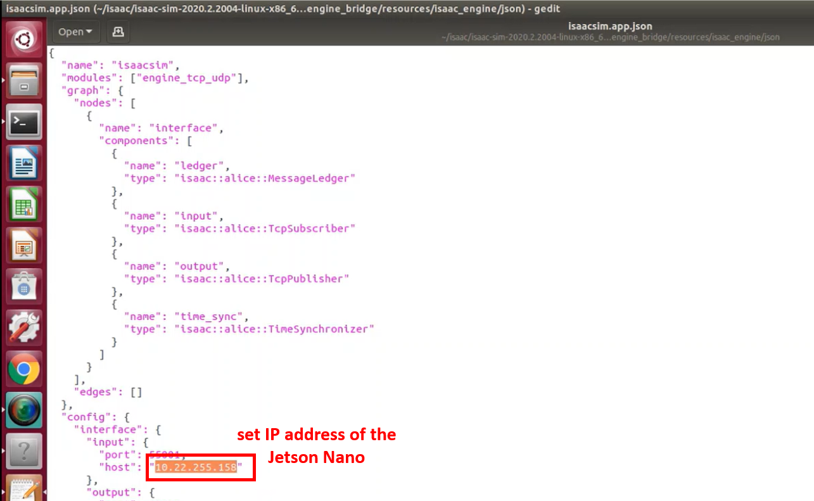

# Overview

This repository contains source code for the *"Fingers Gesture Robot Control"* AI project. 
The program allows to control a robotic arm using fingers gestures (e.g. swipe gesture), through the [NVIDIA Isaac SDK](https://developer.nvidia.com/isaac-sdk) toolbox.

Fingers movements are detected thanks to a *Deep Neural Network* (Resnet18) that processes images acquired by a USB camera.
The output of the neural network is used to command pre-stored positions (in joint space) to a robotic arm.
The software has been tested on a [JetsonNano](https://developer.nvidia.com/embedded/jetson-nano-developer-kit) platform, connected to both a simulated environment ([NVIDIA Isaac Sim](https://developer.nvidia.com/isaac-sim) ) and a real robot ([DENSO WAVE Cobotta robot arm](https://www.denso-wave.com/en/robot/product/collabo/cobotta.html) ).

The network was trained to detect 5 different fingers gestures:
 * middle and index fingers open;
 * middle and index fingers close and swipe towards right;
 * middle and index fingers close and swipe towards left;
 * middle and index fingers close and swipe towards up;
 * middle and index fingers close and swipe towards down.


The project has been submitted to NVIDIA’s Deep Learning Institute (DLI) for the **Jetson AI Specialist certification** (https://developer.nvidia.com/embedded/learn/jetson-ai-certification-programs).

The structure of the repository is as follows:
 * _isaac sdk apps\arm_control_ai_: Isaac SDK application to control robot motion based on the output of the Deep Neural Network;
 * _jetson nano\fingers_A_: it contains the image dataset used for training the network;
 * _jetson nano\fingers_control_model.pth_: the network model after training, used for the demo;
 * _images_: it contains the images used for this README file.

## Requirements

 1. Download and install *NVIDIA Isaac Sim* on the Desktop PC from https://developer.nvidia.com/isaac-sim
 2. Download and install *NVIDIA Isaac SDK* on the Desktop PC from https://developer.nvidia.com/isaac/downloads
 3. Configure the Jetson Nano in order to work with *NVIDIA Isaac SDK* (https://docs.nvidia.com/isaac/isaac/doc/setup.html)
 4. Download and install *NVIDIA DLI Docker container* on the Jetson Nano as explained here: https://courses.nvidia.com/courses/course-v1:DLI+S-RX-02+V2/about
 5. Download and install **PyTorch** on the Jetson Nano as explained here: https://github.com/dusty-nv/jetson-inference/blob/master/docs/building-repo-2.md
 6. Download and install **Jetcam** python package on the Jetson Nano as explained here https://github.com/NVIDIA-AI-IOT/jetcam

## Software Configuration

 1. Copy the *"railab"* folder in the *Isaac SDK "Apps"* folder on the Desktop PC (e.g. /home/railab/isaac/isaac-sdk-20201201-427971df2/sdk/apps)
 2. Modify the content of the *navsim_tcp_subgraph.json* file so to point to the Desktop PC IP address, where *Isaac Sim* is installed (it should be in the folder "*\<Isaac SDK installation path\>/sdk/packages/navsim/apps/"*)


 3. Compile and deploy the *"ai_app"* package according to https://docs.nvidia.com/isaac/isaac/doc/getting_started.html (*"Deploying and Running on Jetson"* Section):
	1. ```cd <Isaac SDK installation path>/sdk```
	2. ```./../engine/engine/build/deploy.sh --remote_user <jetson nano user> -p //apps/railab/arm_control_ai:ai_app-pkg -d jetpack44 -h <jetson nano ip address>```
 4. Copy the *"fingers_control_model.pth"* into the Jetson Nano (in the path that you prefer)

## Neural Network Training

 1. Launch the DLI Docker container (with *"regression_interactive.ipynb"* Jupyter notebook) as in here: https://www.youtube.com/watch?v=LMsUP-W-3FI
 2. Modify the task parameters in the third code cell (*TASK* and *CATEGORIES* parameters) 
 3. Run all the cells and use the notebook to create the training dataset
 4. Set the number of epochs to be used for training the network
 5. Start the training
 6. Save the model


## Run the Demo

 1. Launch *Isaac Sim* on the Desktop PC
 2. In the *"Content"* tab, load the *"ur10_basic.usd"* scenario (e.g. in the folder *"Isaac/Samples/IsaacSDK/Scenario"*) 
 3. In the *"Robot Engine Bridge"* tab, modify the content of the *Application Json Path* so to point to the Jetson Nano IP address (it should be in the folder "*\<Isaac Sim installation path\>/_build/linux-x86_64/release/exts/omni.isaac.robot_engine_bridge/resources/isaac_engine/json"*)



 4. Create the application and launch the simulation
 
 
 
 5. Run the "ai_app.py" application in the Jetson Nano
	1. ```cd <user home directory>/deploy/railab/ai_app-pkg/```
	2. ```.run ./apps/railab/arm_control_ai/ai_app.py --model <path to the trained pth model>```
 6. Place the fingers in front of the camera and move them to move the robot
    
### Bonus: Moving a Real Robot

The FingersGesture application was also tested with a real robot, a [DENSO WAVE Cobotta robot arm](https://www.denso-wave.com/en/robot/product/collabo/cobotta.html).
Robot drivers (based on [b-cap communication protocol](https://www.denso-wave.com/en/robot/product/function/b-CAP.html) ) were developed and integrated into the Isaac SDK.

However, this repository does not contain the source code of the DENSO WAVE Cobotta drivers.

If interested, please contact <info@railab.com>
